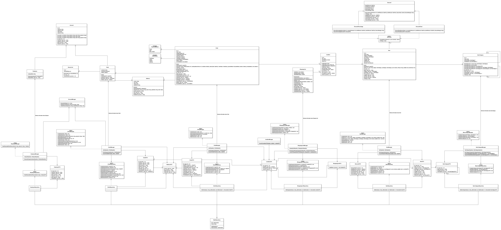

# Synthesis Assignment

Razor Pages Online Shop with Windows Forms Content Management Application.

## Table of Contents

- [Synthesis Assignment](#synthesis-assignment)
  - [Table of Contents](#table-of-contents)
  - [About the Project](#about-the-project)
  - [Features](#features)
  - [Technologies Used](#technologies-used)
  - [Software Architecture](#software-architecture)
  - [Project Structure](#project-structure)
  - [Setup and Installation](#setup-and-installation)
  - [Contributors](#contributors)

## About the Project

**Course:** ICT & Software Engineering

**Semester:** 2

The project develops a software solution using .Net, ASP Razor Pages, Windows Forms Frameworks, and SQL Server to run an online shop managed by employees. This solution enables customers to place orders by selecting items from different categories, adding them to the shopping cart, and completing the order. Customers can check the order status (e.g., in preparation, awaiting shipment, shipped, delivered) and retrieve details of previous orders. Shop employees manage items (grocery and goods) by specifying information about them, making these items available on the website for customers to purchase. The goal is to create an online shop to sell goods and groceries via a website and manage sold items via a desktop application.

## Features

- Managing item information
- Customer and employee authentication system
- Role-Based access control
- Placing an order
- Processing a placed order
- Tracking an order
- Bonus Card
- Bonus Points
- Multiple Product Discounts Categories _(Strategy Pattern Implementation)_
- Unit Tests

## Technologies Used

- **Programming Languages/Technologies:**
  - C#
  - SQL
  - HTML
  - CSS
- **Libraries/Frameworks:**
  - .NET 6.0
  - ASP.NET Core
  - Windows Forms
  - MSTest
  - Razor Pages
- **Tools:**
  - Visual Studio 2022
  - Git
  - GitLab
  - Microsoft SQL Server

## Software Architecture

The Synthesis Assignment System follows a 3-Tier Architecture to ensure modularity, scalability, and separation of concerns. The architecture consists of the following layers:

1. _Presentation Layer (**PL**)_: **Depends on the BLL Interfaces and <u>references DAL only for the use of Dependency Injection in Unit Tests</u>.**
   - _Web Interface (Razor Pages)_: Online Shop for customers.
   - _Desktop Interface (Windows Forms)_: Desktop application providing product management functionality for administrators.
2. _Business Logic Layer (**BLL**)_: Contains all the core business rules and application logic. **No dependencies.**
3. _Data Access Layer (**DAL**)_: This layer interacts directly with the database. It handles all CRUD operations and converts data into DTO's. **Depends on the BLL Interfaces**

```
+---------------------------------------+
|           Presentation Layer          |
|---------------------------------------|
|                                       |
|       Display generated content       |
|                                       |
+---------------------------------------+
                    |
                    |   Dependency Inversion
                    ▼
+---------------------------------------+
|         Business Logic Layer          |
|---------------------------------------|
|                                       |
|    Handles core application rules     |
|                                       |
+---------------------------------------+
                    ▲
                    |   Dependency Inversion
                    |
+---------------------------------------+
|          Data Access Layer            |
|---------------------------------------|
|                                       |
|    CRUD operations on SQL database    |
|                                       |
+---------------------------------------+

```



## Project Structure

```
synthesis-assignment/
|
├── WinFormsApp/                 # PL Windows Forms Source Code
|
├── WebApp/                      # PL Razor Pages Source Code
|
├── LogicLayer/                  # BLL Source Code
│   ├── InterfacesRepository     # Interfaces for Dependency Inversion
│   └── InterfacesManagers       # Interfaces for Dependency Inversion
|
├── DataAccessLayer/             # DAL Source Code
|
├── UnitTests/                   # Unit Tests
|
├── Documentation/               # Project Documentation
|
└── README.md
```

## Setup and Installation

Follow the instructions below to set up the project on your local machine.

1. **Clone the Repository**
   ```
   git clone https://github.com/your-username/project-repo-name.git
   cd project-repo-name
   ```
2. **Install Dependencies**
   ```
   dotnet restore
   ```
3. **Create Database Schema from `databasecreation.sql` file**
4. **Compile/Build the Project**
   ```
   dotnet build
   ```
5. **Run Unit Tests**
   ```
   dotnet test
   ```
6. **Run the Project**
   ```
   dotnet run
   ```

## Contributors

- [Grzegorz Malisz](https://github.com/grzgm): Author.
